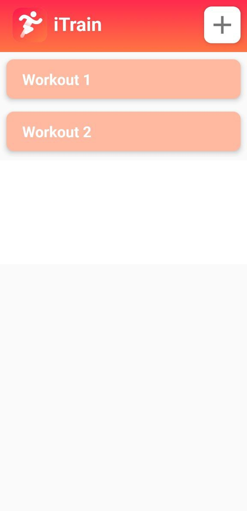
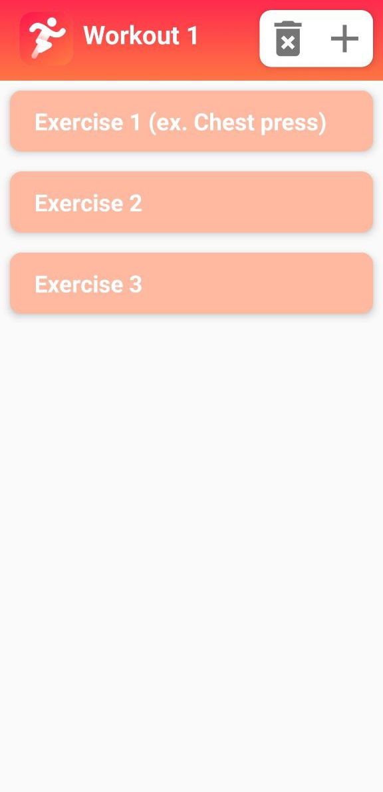
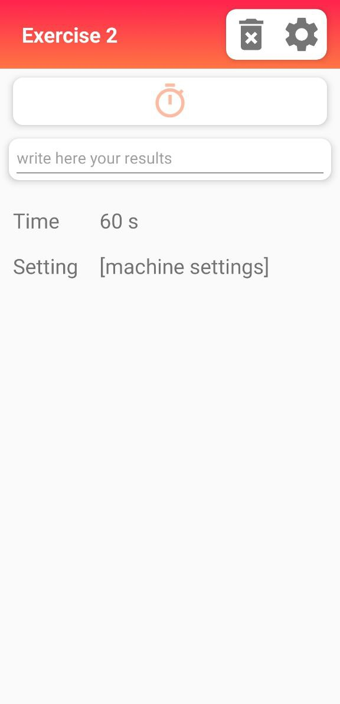

# 2022 iTrain

This is a simple application that is used to keep track execution and pause time to execute same exercise for Physiotherapy or Workout.

## 🎞️ Snapshots

  
  
  

## 🙋 Info

for any doubt, clarification or suggestion to improve the application you can contact me on:

-   send me an email at: lambertini.1938390@studenti.uniroma1.it
-   send me a DM on instagram [Link 🔗](https://www.instagram.com/lambertinialessandro/)

